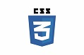
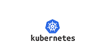
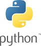

# Hi 👋, I'm JEAN MARIE TALA
==========================

### A passionate fullstack web developper

- I'm bilingual : fluent in french and english
- 🌱 I’m currently learning **fullstack web path on [Udacity](https://learn.udacity.com/)**
- 👨‍💻 All of my projects are available at [here](https://github.com/kouffen/) 
- 💬 Ask me about **Python,Java, SQL, javascript,  PostgreSQL, Postman, GIT, AWS**
- 📫 How to reach me **talajeanmarie@gmail.com**
- 📄 Know about my experiences [here](https://www.linkedin.com/in/jean-marie-tala-52518715/)

### Connect with me:

 

### Languages and Tools:

 

